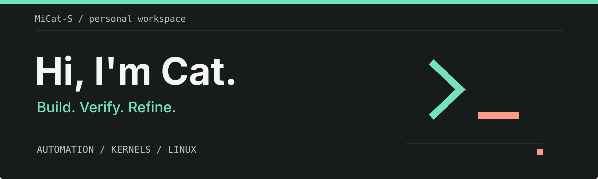

 
 

**自动化工具 · Android 内核 · 订阅工具 · Linux 自托管**

把复杂的部署、构建和维护流程，变成可复现、可验证、可回滚的日常工具。

 

 

## 关于我

我是 Cat，喜欢从实际使用中的问题出发，维护、适配和打磨工具。

比起让程序只运行一次，我更关心它能否稳定部署、顺利更新，以及在出问题时恢复。也希望把这些经验写进文档，让第一次使用的人能照着完成。

## 正在折腾

| 方向 | 关注的事情 |
| :--- | :--- |
| **Linux 自动化** | 服务部署、更新、运维与故障恢复 |
| **Android 内核** | GKI、KernelSU 与可复现构建工作流 |
| **订阅工具** | 代理规则、订阅转换与 Sub-Store 生态 |
| **构建与交付** | GitHub Actions、PM2、systemd 与发布验证 |

## 做事的习惯

- **可复现**：把重复操作沉淀为脚本和构建流程。
- **可验证**：关注真实运行、更新、回滚和跨架构检查。
- **可维护**：让工具与文档一起完善，让后续使用有据可循。

 

---

Build it reproducibly. Verify it for real. Keep a way back.

